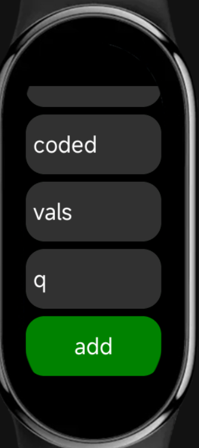
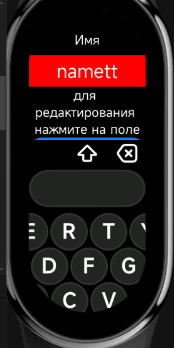

# TOTP App for Xiaomi Mi Band 9

> [!NOTE]  
> Generate TOTP codes directly on your Mi Band — no internet connection required.

---

## 1. Add a TOTP Entry
Easily add a new entry by specifying a **Name** and **TOTP secret**.

---

## 2. View Saved TOTPs
Quickly browse through your saved TOTP entries.

---

## 3. Generate TOTP
Generate a secure TOTP code directly on your band.

---

## Other Images

